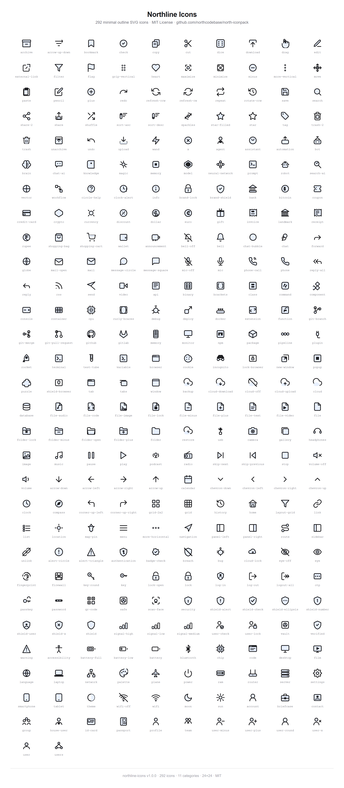

# Northline Icons

<p align="center">
  
</p>

<p align="center">
  <a href="https://github.com/northcodebase/north-iconpack/blob/main/LICENSE"></a>
  <a href="https://github.com/northcodebase/north-iconpack/releases"></a>
  
  
  
</p>

<p align="center">
  A minimal, outline-based SVG icon library built for modern web applications.
</p>

---

## Features

- **77 hand-crafted SVG icons** across 11 categories
- **Consistent 24×24 grid** with 1.8px stroke width throughout
- **Outline style** — clean, modern, and framework-agnostic
- **Zero dependencies** — drop in as raw SVG or reference by path
- **Lucide-compatible naming** — predictable, semantic, kebab-case filenames
- **Organized by category** — actions, navigation, security, and more
- **MIT licensed** — use freely in personal and commercial projects

---

## Categories

| Category | Count | Description |
|---|---|---|
| `actions` | 22 | Copy, trash, search, upload, sparkles, and more |
| `security` | 19 | Lock, shield variants, eye, fingerprint, key, signals |
| `navigation` | 8 | Home, menu, arrow, map pin, list, grid |
| `users` | 6 | User, users, briefcase, passport, id-card |
| `system` | 6 | Settings, server, wifi, code, plane, film |
| `files` | 3 | Folder, database, file-lock |
| `commerce` | 3 | Credit card, shopping bag, landmark |
| `communication` | 3 | Mail, bell, globe |
| `alerts` | 3 | Info, circle-help, clock-alert |
| `theme` | 2 | Moon, sun |
| `brands` | 2 | Brand shield, brand lock |

---

## Installation

### Option 1 — Copy SVGs directly

Download the release archive and copy the `icons/` folder into your project:

```
your-project/
└── icons/
    ├── actions/
    ├── security/
    └── ...
```

### Option 2 — Reference via URL (CDN — coming soon)

```html

```

### Option 3 — Inline SVG

Copy the SVG source directly from any file and paste it inline in your HTML or component.

---

## Usage

### HTML

```html
<!-- Inline -->
<svg width="24" height="24" viewBox="0 0 24 24" fill="none" xmlns="http://www.w3.org/2000/svg">
  <!-- paste icon path here -->
</svg>

<!-- Image tag -->

```

### React / JSX

```jsx
import { ReactComponent as LockIcon } from './icons/security/lock.svg';

export function Example() {
  return <LockIcon width={24} height={24} stroke="currentColor" />;
}
```

### CSS background

```css
.icon-lock {
  background-image: url('icons/security/lock.svg');
  background-size: 24px 24px;
  width: 24px;
  height: 24px;
}
```

### Vite / Webpack (raw import)

```js
import lockSvg from './icons/security/lock.svg?raw';

element.innerHTML = lockSvg;
```

---

## Folder Structure

```
northline-icons/
│
├── icons/
│   ├── actions/        (22 icons)
│   ├── navigation/     (8 icons)
│   ├── security/       (19 icons)
│   ├── communication/  (3 icons)
│   ├── files/          (3 icons)
│   ├── commerce/       (3 icons)
│   ├── users/          (6 icons)
│   ├── alerts/         (3 icons)
│   ├── system/         (6 icons)
│   ├── theme/          (2 icons)
│   └── brands/         (2 icons)
│
├── assets/
│   └── preview.png
│
├── README.md
├── LICENSE
├── CHANGELOG.md
├── CONTRIBUTING.md
├── CODE_OF_CONDUCT.md
└── metadata.json
```

---

## Icon Naming Convention

All icons follow **Lucide-compatible kebab-case** naming:

| Rule | Example |
|---|---|
| Lowercase kebab-case | `shield-alert.svg` |
| Singular nouns | `star.svg` not `stars.svg` |
| No redundant words | `eye.svg` not `view-password.svg` |
| Directional suffix | `arrow-left.svg` |
| State suffix | `lock-open.svg`, `star-filled.svg` |
| Modifier suffix | `signal-low.svg`, `signal-high.svg` |

---

## Design Specifications

| Property | Value |
|---|---|
| Grid size | 24 × 24 |
| Viewbox | `0 0 24 24` |
| Stroke width | 1.8px |
| Stroke linecap | `round` |
| Stroke linejoin | `round` |
| Fill | `none` (outline) |
| Style | Minimal outline |

---

## Contributing

Contributions are welcome. Please read [CONTRIBUTING.md](CONTRIBUTING.md) before submitting a pull request.

---

## Code of Conduct

This project follows the [Contributor Covenant](CODE_OF_CONDUCT.md). By participating, you agree to uphold these standards.

---

## License

[MIT](LICENSE) © Northline
